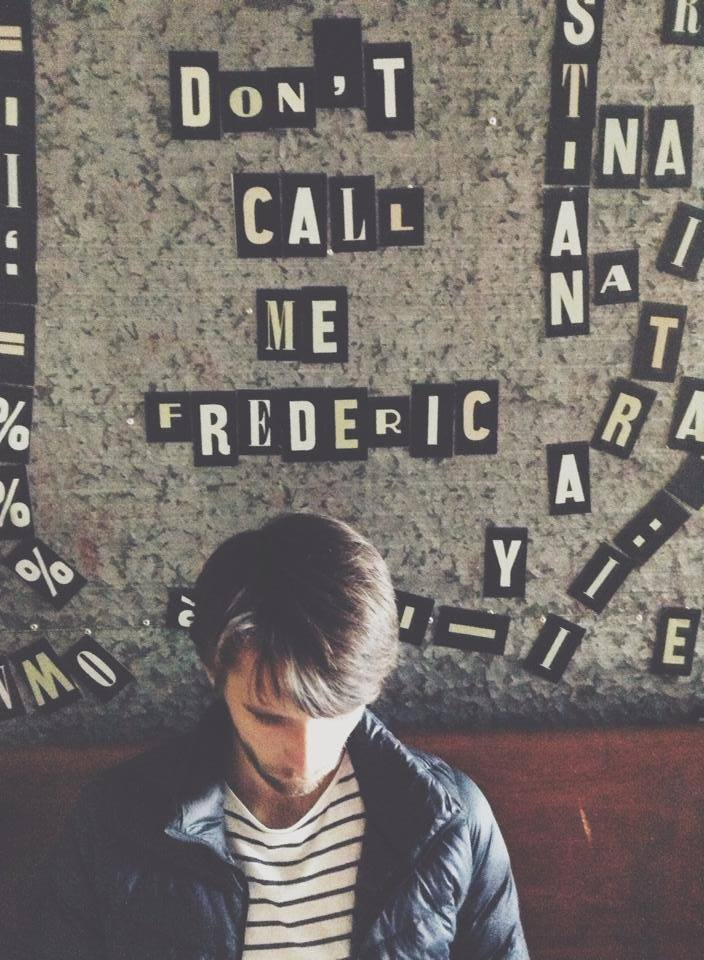

 
_Swede living in Berlin. Mixing work in **Machine Learning** and **Big Data Analytics** with teaching **Swing dance** in the evenings, visiting new places and trying to figure out what are the keys to a meaningful life._

After working in full stack web development for the first years after college and then transitioning into a Product Owner role, I gradually realised that machine learning and data science are what really excites me and for the past few years, I've deliberately been taking my career in that direction.

 
## The Blog
As I'm usually either taking some online classes, working on some projects of my own and/or deciding to spend a few hours to try out something new - I might as well document it.

Quite telling, the whole blog [started out](/2018/01/16/hello-world.html) as just one of those one-day projects where I wanted to compare some different static site generators and test putting the result up as a Github page.

Keeping the blog is for now mainly a way to motivate me to reach a point with a concrete outcome that I can do a writeup about.

In other words; nothing written here is really intended for an audience besides myself, but if there is anything that you find helpful then that is of course great.

 
## Contact me
You can e-mail me at freddiekarlbom {at} gmail {dot} com or [connect on LinkedIn](https://www.linkedin.com/in/freddiekarlbom).

 

_...and just for the record; my name really is Freddie so please don't call me Frederic, Fredrik, Freddy or any other variation you might confuse it with. Thanks in advance!_
